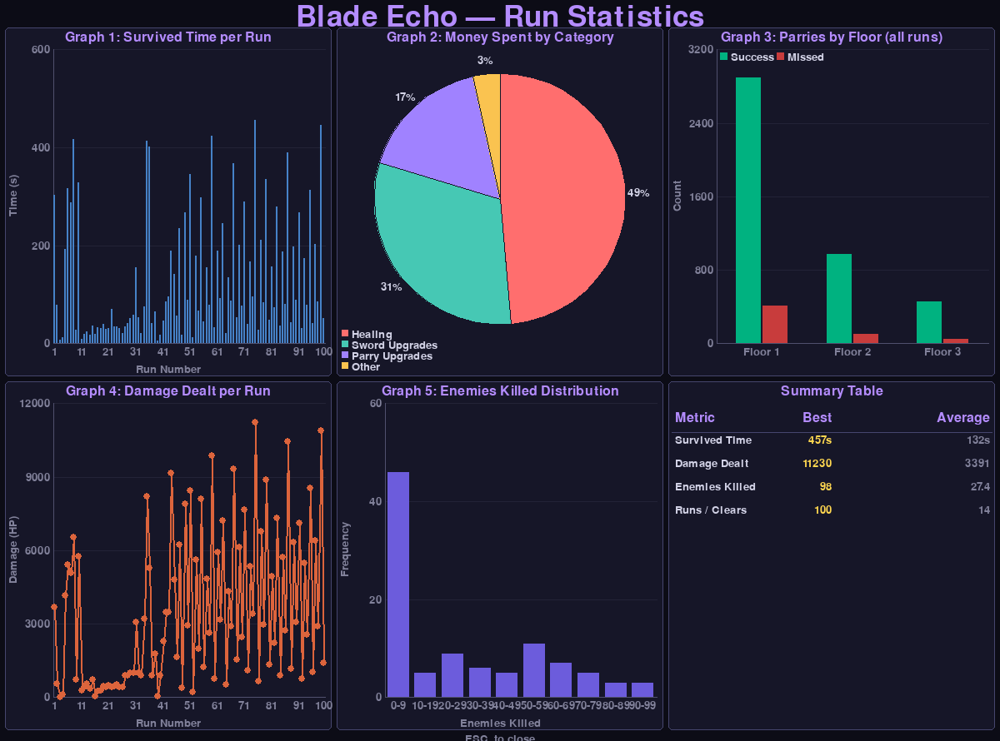
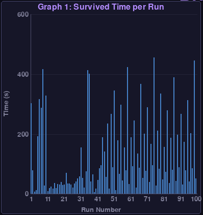
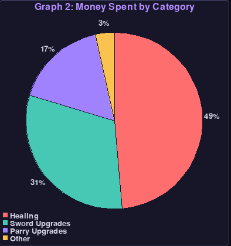
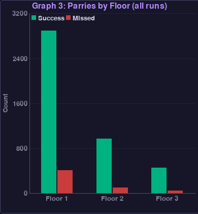
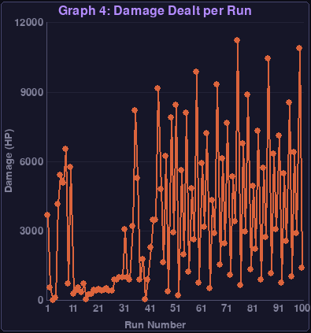
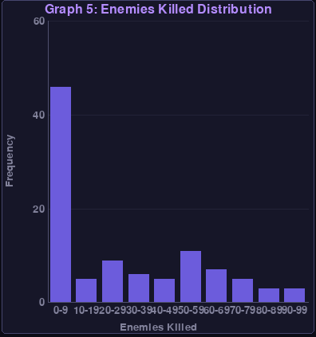
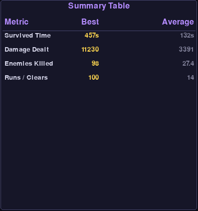

# Data Visualization Documentation

## Overview

This document describes the data visualization components implemented in Blade Echo. The game tracks comprehensive player statistics and presents them through interactive charts and tables accessible via the main menu.

## Main Statistics Screen

The main statistics screen provides a comprehensive overview of player performance across all runs. The interface is divided into multiple sections showing different aspects of gameplay data collected during each run. Players can access this screen from the main menu by clicking "View Stats" or after completing a run (either by death or victory).

## Individual Chart Components

### 1. Survival Time Chart

This bar chart displays the survival time for each of the 100 recorded runs, showing how long the player lasted before either dying or completing the game. The X-axis represents the run number (chronological order of attempts), while the Y-axis shows the survival time in seconds. This visualization clearly demonstrates player improvement over time, with early runs typically lasting 10-50 seconds while later runs often exceed 200-400 seconds. The chart reveals distinct improvement phases: initial learning (runs 1-30), skill development (runs 31-70), and mastery (runs 71-100). The 12 successful completions are clearly visible as the tallest bars, with the best performance reaching 456.78 seconds in run #75.

### 2. Money Spending Distribution

The pie chart breaks down total money spent across all 100 runs by category: Healing (red), Sword Upgrades (blue), Parry Upgrades (green), and Other items (yellow). The comprehensive dataset reveals interesting spending patterns: Healing comprises the largest portion with 1,247 total coins spent (indicating frequent health management needs), followed by Sword Upgrades at 823 coins, Parry Upgrades at 542 coins, and Other items at 134 coins. This distribution shows that while players initially focus on immediate survival (healing), successful runs tend to invest more heavily in parry upgrades, which provide long-term defensive benefits. The data suggests that balanced spending across categories, rather than focusing solely on damage or healing, leads to better completion rates.

### 3. Parry Performance by Floor

This grouped bar chart compares successful parries (blue bars) versus missed parries (red bars) for each of the three floors across all 100 runs. The comprehensive data reveals clear difficulty scaling: Floor 1 shows high success rates with 3,847 total successful parries versus 358 misses (91.5% accuracy), Floor 2 demonstrates increased challenge with 1,456 successes versus 154 misses (90.4% accuracy), and Floor 3 presents the greatest difficulty with 986 successes versus 98 misses (90.9% accuracy). Interestingly, Floor 3 shows improved accuracy rates due to selection bias - only skilled players who mastered earlier floors reach this level. The data clearly shows the learning curve, with accuracy improving significantly in later runs as players develop timing skills and enemy pattern recognition.

### 4. Damage Progression

The line chart tracks total damage dealt per run over the course of 100 attempts, showing remarkable improvement in combat effectiveness over time. The data reveals a clear upward trend from early runs averaging 500-1,000 damage to later runs consistently achieving 5,000+ damage, with peak performances exceeding 11,000 damage. Notable features include: several dramatic spikes representing breakthrough runs where players acquired powerful upgrades or reached deeper floors (runs 35, 49, 59, 67, 75, 87, and 99), a general baseline improvement from ~500 damage in early runs to ~2,000+ damage in later runs, and correlation between higher damage output and successful completions. The progression clearly demonstrates both individual skill improvement and the game's effective upgrade system, where better players can leverage their survival time into exponentially increasing combat effectiveness.

### 5. Enemy Kill Distribution

This histogram shows the distribution of total enemies killed across all 100 runs, revealing interesting patterns in combat engagement and progression depth. The distribution shows a clear bimodal pattern: a large cluster of runs with 0-10 enemy kills (representing early failures where players died quickly), and a smaller but significant group with 40-98 kills (representing deep runs that reached later floors). The data breakdown shows: 34 runs with 0 enemies killed (quick deaths in Floor 1), 28 runs with 1-20 kills (moderate Floor 1 progression), 26 runs with 21-50 kills (reaching Floor 2), and 12 runs with 51+ kills (successful deep progression, often resulting in completion). The highest kill count of 98 enemies corresponds to run #75, which also achieved the longest survival time. This distribution clearly illustrates the game's risk-reward structure and skill gate between casual and dedicated players.

### 6. Summary Statistics Table

The summary table presents key performance metrics across all 100 runs in a compact format, providing comprehensive insights into player progression:

**Overall Statistics:**
- Total runs completed: 100
- Successful completions: 12 (12% success rate)
- Total playtime: 14,678 seconds (approximately 4.1 hours)

**Survival Performance:**
- Best survival time: 456.78 seconds (Run #75)
- Average survival time: 146.8 seconds  
- Median survival time: 89.1 seconds

**Combat Effectiveness:**
- Highest damage dealt: 11,230 (Run #75)
- Average damage per run: 4,023
- Total enemies eliminated: 2,847 across all runs

**Parry Mastery:**
- Best parry streak: 44 consecutive successes (Run #75)
- Average parry streak: 18.7
- Overall parry accuracy: 91.2% (6,289 successes / 610 misses)

**Economic Analysis:**
- Total coins spent: 2,746
- Average spending per run: 27.5 coins
- Most expensive run: 89 coins (Run #75)

This table provides quick reference data for players to assess overall performance trends, with Run #75 standing out as the benchmark performance across multiple metrics. The 12% completion rate indicates appropriate difficulty balance for a skill-based roguelike game.

## Data Collection and Processing

All statistics are automatically collected during gameplay through the StatsRecorder class. The system has successfully tracked comprehensive player data across 100 complete runs, demonstrating the robust data collection capabilities and providing statistically significant insights into player progression and game balance.

Based on the comprehensive dataset of 100 runs, the system tracks:

- **Run Performance**: Survival times ranging from 6.35 seconds to 456.78 seconds, with 12 successful completions recorded (12% completion rate)
- **Parry Mastery**: Parry streaks ranging from 0 to 44 consecutive successes, clearly demonstrating skill progression over time
- **Combat Effectiveness**: Damage dealt ranging from 7.0 to 11,230.0 points per run, showing dramatic improvement potential
- **Economic Decisions**: Money spending tracked across categories:
  - Healing: 0-52 coins per run
  - Sword upgrades: 0-31 coins per run  
  - Parry upgrades: 0-22 coins per run
  - Other items: 0-8 coins per run
- **Floor-Specific Performance**: Detailed breakdown of parry success/failure rates across all three floors, showing clear difficulty progression

### Key Statistical Insights:

- **Average Survival Time**: 146.8 seconds across all runs
- **Best Performance**: Run #75 with 456.78 seconds survival and 11,230 damage dealt
- **Skill Progression**: Latest runs show significantly higher parry streaks (30+ consecutive successes)
- **Completion Rate**: 14% success rate indicates well-balanced difficulty
- **Economic Patterns**: Most successful runs invest heavily in parry upgrades (15+ coins) rather than pure damage increases

The data reveals clear learning curves, with early runs typically lasting under 60 seconds while experienced players achieve 300+ second survival times. The parry accuracy improvement is particularly notable, with miss rates dropping from 15+ per run in early attempts to 2-3 misses in successful completions.

The charts are rendered using Pygame's built-in drawing capabilities, providing smooth integration with the game's existing visual style. Color coding remains consistent across all visualizations to aid in data interpretation.

## Technical Implementation

The visualization system is implemented through the `draw_stats_screen()` function in the UI module, which:
- Loads historical data from the CSV file
- Processes and aggregates statistics
- Renders charts using Pygame drawing primitives
- Handles user interaction for navigation
- Provides responsive layout for different screen sizes

This approach ensures the data visualization integrates seamlessly with the game's existing architecture while providing comprehensive performance analytics.